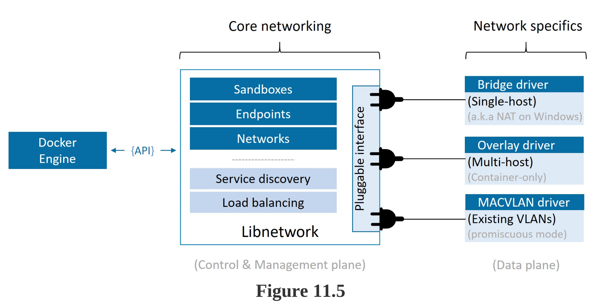
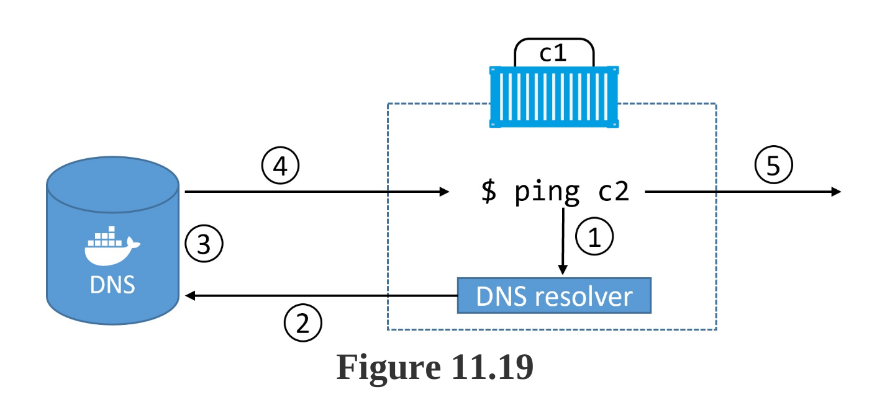

# DOCKER DEEP DIVE NOTEBOOK

## Table of Contents

- [DOCKER DEEP DIVE NOTEBOOK](#docker-deep-dive-notebook)
  - [Table of Contents](#table-of-contents)
  - [About](#about)
  - [Part 1: The big picture stuff](#part-1-the-big-picture-stuff)
    - [1: Containers from 30,000 feet](#1-containers-from-30000-feet)
    - [2: Docker](#2-docker)
    - [3: Installing Docker](#3-installing-docker)
    - [4: The big picture](#4-the-big-picture)
  - [Part 2: The technical stuff](#part-2-the-technical-stuff)
    - [5: The Docker Engine](#5-the-docker-engine)
    - [6: Images <a name = "6"></a>](#6-images-)
    - [7: Containers](#7-containers)
    - [8: Containerizing an app](#8-containerizing-an-app)
    - [9: Deploying Apps with Docker Compose](#9-deploying-apps-with-docker-compose)
    - [10: Docker Swarm](#10-docker-swarm)
    - [11: Docker Networking](#11-docker-networking)
    - [12: Docker overlay networking](#12-docker-overlay-networking)
    - [13: Volumes and persistent data](#13-volumes-and-persistent-data)
    - [14: Deploying apps with Docker Stacks](#14-deploying-apps-with-docker-stacks)
    - [15: Security in Docker](#15-security-in-docker)
    - [16: What next](#16-what-next)


## About
Write about 1-2 paragraphs describing the purpose of your project.

## Part 1: The big picture stuff
### 1: Containers from 30,000 feet
- We used to live in a world where every time the business wanted a new application we had to buy a brand-new server.
- VMware came along and enabled us to drive more value out of new and existing company IT assets. 
- Following the success of VMware and hypervisors came a newer more efficient and lightweight virtualization technology called containers. 
- But containers were initially hard to implement and were only found in the data centers of web giants that had Linux kernel engineers on staff. 
- Along came Docker, Inc. and suddenly containers were available to the masses.

### 2: Docker
- Docker, Inc. is a technology company out of San Francisco with an ambition to change the way we do software. They were arguably the first-movers and instigators of the modern container revolution.
- The Docker technology focuses on running and managing application containers. It runs on Linux and Windows, can be installed almost anywhere, and is currently the most popular container runtime used by Kubernetes.

### 3: Installing Docker

- You can run Docker almost anywhere and most of the installation methods are simple. (Windows, Linux, Mac, Kubenetes)
- Play with Docker is a free 4-hour Docker playground on the internet.
- Stable vs. Edge Count:
  + Edge (beta) released monthly, Stable quarterly.
  + Edge get new features first, but only supported for a month.
- Install docker Edge releases (not recommended for production environment):
```
curl -fsSL https://get.docker.com -o get-docker.sh
sudo sh get-docker.sh
```
- Install docker Stable releases:
```
sudo apt update
sudo apt-get install ca-certificates curl gnupg lsb-release
curl -fsSL https://download.docker.com/linux/ubuntu/gpg | sudo gpg --dearmor -o /usr/share/keyrings/docker-archive-keyring.gpg
echo \
"deb [arch=$(dpkg --print-architecture) signed-by=/usr/share/keyrings/docker-archive-keyring.gpg] https://download.docker.com/linux/ubuntu \
$(lsb_release -cs) stable" | sudo tee /etc/apt/sources.list.d/docker.list > /dev/null
sudo apt-get update
sudo apt-get install docker-ce docker-ce-cli containerd.io docker-compose-plugin
```
- Add current user to docker group
```
sudo usermod -aG docker ${USER}
```

### 4: The big picture
- In the Ops section of the chapter:
  - You downloaded a Docker image 
  - Launched a container from it
  - Logged into the container
  - Executed a command inside of it
  - Then stopped and deleted the container.
```
docker version
docker image ls
docker image pull ubuntu:latest
docker container run -it ubuntu:latest /bin/bash
ps -elf
# Ctrl-PQ to exit the running container without killing it
docker container ls
docker container exec -it vigilant_borg bash
docker container ls
docker container stop vigilant_borg
docker container rm vigilant_borg
docker container ls -a
```

- In the Dev section:
  - You containerized a simple application by pulling some source code from GitHub.
  - Building it into an image using instructions in a Dockerfile. 
  - You then ran the containerized app.
```
git clone https://github.com/nigelpoulton/psweb.git
cd psweb
cat Dockerfile
docker image build -t test:latest .
docker image ls
docker container run -d \
--name web1 \
--publish 8080:8080 \
test:latest
```

## Part 2: The technical stuff
### 5: The Docker Engine
- The Docker engine is modular in design and based heavily on open-standards from the OCI.

- The Docker daemon implements the Docker API which is currently a rich, versioned, HTTP API that has developed alongside the rest of the Docker project.
- Container execution is handled by containerd. 
  - It as a container supervisor that handles container lifecycle operations.
  - It is small and lightweight and can be used by other projects and third-party tools.
- containerd needs to talk to an OCI-compliant container runtime to actually create containers.
- Docker uses runc as its default container runtime.
  - runc is the de facto implementation of the OCI runtime-spec and expects to start containers from OCI-compliant bundles. 
  - containerd talks to runc and ensures Docker images are presented to runc as OCI- compliant bundles. 
- runc can be used as a standalone CLI tool to create containers.
- It’s based on code from libcontainer, and can also be used by other projects and third-party tools.
- Functionality currently still inside of the Docker daemon (may be broken out over time):
  - The Docker API
  - Image management
  - Authentication
  - Security features
  - Core networking

### 6: Images <a name = "6"></a>
- **IMAGES - THE COMMANDS**

  - `docker image pull` is the command to download images
  ```
  docker image pull alpine:latest
  ```

  - `docker image ls` lists all of the images stored in your Docker host’s local image cache
  ```
  docker image ls
  docker image ls -a
  docker image ls --digests alpine
  ```

  - `docker image inspect` gives you all of the glorious details of an image — layer data and metadata.
  ```
  docker image inspect ubuntu:latest
  ```

  - `docker manifest inspect` allows you to inspect the manifest list of any image stored on Docker Hub.
  ```
  docker manifest inspect redis
  ```

  - `docker buildx` is a Docker CLI plugin that extends the Docker CLI to support multi-arch builds.
  - `docker image prune` allow delete dangling images on a system
  ```
  docker image prune 
  docker image prune -a
  ```

  - `docker image rm` is the command to delete images.
  ```
  docker image rm alpine:latest
  docker image rm 6852022de69d 6ba12825d092
  docker image rm $(docker image ls -q) -f
  ```

- **CHAPTER SUMMARY**
- We learned that they contain everything needed to run an application. This includes; just enough OS, source code files, and dependencies.
- They are made up of one or more read-only layers, that when stacked together, make up the overall image.
- We used the docker image pull command to pull some images into our Docker host’s local registry.
- We covered image naming, official and unofficial repos, layering, sharing, and crypto IDs.


- We looked at how Docker supports multi-architecture and multi-platform images, and we finished off by looking at some of the most common commands used to work with images.


### 7: Containers
- **CONTAINERS - THE COMMANDS**
- `docker container run` is the command used to start new containers.
  ```
  docker container run -it ubuntu /bin/bash
  docker container run -d --name always --restart always alpine sleep 1d
  docker container run -d --name unless-stopped --restart unless-stopped alpine sleep 1d
  docker container run -d --name webserver -p 80:8080 nigelpoulton/pluralsight-docker-ci
  ```

- `Ctrl-PQ` will detach your shell from the terminal of a container and leave the container running (UP) in the background.

- `docker container ls` lists all containers in the running (UP) state.
  ```
  docker container ls -a
  ```

- `docker container exec` runs a new process inside of a running container.
  ```
  docker container exec -it percy bash
  ```

- `docker container stop` will stop a running container and put it in the Exited (0) state
  ```
  docker container stop always unless-stopped
  docker container stop $(docker container ps -q)
  ```

- `docker container start` will restart a stopped (Exited) container
  ```
  docker container start 9be8d4fcdc44
  docker container start psweb
  ```

- `docker container rm` will delete a stopped container.
  ```
  docker container rm 9be8d4fcdc44
  docker container rm -f $(docker container ps -aq)
  ```

- `docker container inspect` will show you detailed configuration and runtime information about a container.
  ```
  docker container inspect psweb
  ```
- **CHAPTER SUMMARY**
- We compared and contrasted the container and VM models.


- We saw how to use the docker container run command to start a couple of simple containers.
- We saw the difference between interactive containers in the foreground versus containers running in the background.
- We know that killing the PID 1 process inside of a container will kill the container.
- We’ve seen how to start, stop, and delete containers.
- We finished the chapter using the docker container inspect command to view detailed container metadata.

### 8: Containerizing an app
- **THE COMMANDS**
- docker image build is the command that reads a Dockerfile and containerizes an application
  ```
  docker image build -t test:latest .
  docker image build -t multi:stage .
  docker image build -t test.latest -f Dockerfiles .
  ```
- Sample Dockerfile:
  ```
  FROM alpine
  LABEL maintainer="nigelpoulton@hotmail.com"
  RUN apk add --update nodejs npm curl
  COPY . /src
  WORKDIR /src
  RUN  npm install
  EXPOSE 8080
  ENTRYPOINT ["node", "./app.js"]
  ```
- The FROM instruction in a Dockerfile specifies the base image. You should use images from official repos on this line.
- The RUN instruction in a Dockerfile allows you to run commands inside the image. Each RUN instruction creates a single new layer.
- The COPY instruction in a Dockerfile adds files into the image as a new layer
- The EXPOSE instruction in a Dockerfile documents the network port that the application uses.
- The ENTRYPOINT instruction in a Dockerfile sets the default application
to run when the image is started as a container.
- Other Dockerfile instructions include LABEL, ENV, ONBUILD, HEALTHCHECK, CMD and more…

- **CHAPTER SUMMARY**
- We learned how to containerize an application.

- We learned the basics of how Dockerfiles work, and fed one into a docker image build command to create a new image.
- How multi-stage builds give us a simple way to build and ship smaller images to our production environments.

- We also learned that the Dockerfile is a great tool for documenting an app.

### 9: Deploying Apps with Docker Compose
- **THE COMMANDS**
- docker compose up is the command to deploy a Compose app. (v2)
  ```
  docker compose up
  docker compose up &
  docker compose up -d
  docker compose up -f docker-compose-test.yml -d
  ```
- docker-compose stop will stop all of the containers in a Compose app without deleting them from the system
- docker-compose rm will delete a stopped Compose app.
- docker-compose restart will restart a Compose app that has been stopped with docker-compose stop.
- docker-compose down will stop and delete a running Compose app.
  ```
  docker compose stop
  docker compose rm
  docker compose restart
  docker compose down
  ```
- docker-compose ps will list each container in the Compose app.
- docker-compose ls will list the Compose app.
  ```
  docker compose ps
  docker compose ls
  ```

- **CHAPTER SUMMARY**
- You learned how to deploy and manage a multi-container application using Docker Compose.
- Docker Compose is a Python application that you install on top of the Docker Engine.
- Compose files can be YAML or JSON
- They define all of the containers, networks, volumes, and secrets that an application requires.
- Once the app is deployed, you can manage its entire lifecycle using the many docker-compose sub-commands.
- You also saw how volumes have a separate lifecycle to the rest of the app, and can be used to mount changes directly into containers.

- Docker Compose is popular with developers, and the Compose file is an excellent source of application documentation.
- It can help bridge the gap between dev and ops

### 10: Docker Swarm
- **THE COMMANDS**
- Open firewall if use iptables:
  ```
  sudo iptables -I INPUT -p tcp -m tcp --dport 2377 -j ACCEPT
  sudo iptables -I INPUT -p tcp -m tcp --dport 7946 -j ACCEPT
  sudo iptables -I INPUT -p udp -m udp --dport 7946 -j ACCEPT
  sudo iptables -I INPUT -p udp -m udp --dport 4789 -j ACCEPT
  sudo iptables -I INPUT -p 50 -j ACCEPT
  ```
- Open firewall if use ufw:
  ```
  sudo ufw allow from 10.0.30.0/24 proto tcp to any port 2377
  sudo ufw allow from 10.0.30.0/24 proto tcp to any port 7946
  sudo ufw allow from 10.0.30.0/24 proto udp to any port 7946
  sudo ufw allow from 10.0.30.0/24 proto udp to any port 4789
  ```
- If you use new version of docker, and OS, you can get error (vmxnet3 does not support checksum/TSO offload for Geneve/VXLAN encapsulated packets): 
  - https://github.com/moby/moby/issues/41775
  - https://www.spinics.net/lists/kernel/msg3533343.html
- You can fix them by run command: 
  ```
  sudo ethtool -K ens160 tx-checksum-ip-generic off
  ```
- `docker swarm init` is the command to create a new swarm. The node run the command on becomes the first manager and is switched to run in swarm mode.
- `docker swarm join-token` reveals the commands and tokens needed to join workers and managers to existing swarms.
- `docker node ls` lists all nodes in the swarm.
  ```
  docker swarm init --advertise-addr 10.0.30.11:2377 --listen-addr 10.0.30.11:2377
  docker swarm init --autolock
  docker swarm join-token worker
  docker swarm join-token manager
  docker node ls
  ```

- `docker service create` is the command to create a new service.
- `docker service ls` lists running services in the swarm.
- `docker service ps <service>` gives more detailed information about individual service replicas.
- `docker service inspect` gives very detailed information on a service.
- `docker service scale` lets you scale the number of replicas in a service up and down.
- `docker service update` lets you update many of the properties of a running service.
- `docker service logs` lets you view the logs of a service.
- `docker service rm` is the command to delete a service from the swarm
  ```
  docker network create -d overlay uber-net
  docker service create --name uber-svc \
  --network uber-net \
  -p 80:80 --replicas 3 \
  nigelpoulton/tu-demo:v1

  docker service ls
  docker service ps uber-svc
  docker service inspect uber-svc --pretty
  docker service scale uber-svc=12
  docker service update --image nigelpoulton/tu-demo:v2 \
  --update-parallelism 2 \
  --update-delay 20s uber-svc
  
  docker service logs uber-svc
  docker service rm uber-svc
  docker network rm uber-net
  ```

- **CHAPTER SUMMARY**
- Docker Swarm is Docker’s native technology for managing clusters of Docker nodes and deploying and managing cloud-native applications. It is similar to Kubernetes.
- Swarm has a secure clustering component, and an orchestration component.
- The secure clustering component is enterprise-grade and offers a wealth of security and HA features that are automatically configured and extremely simple to modify.


- The orchestration component allows you to deploy and manage cloud-native microservices applications in a simple declarative manner.


### 11: Docker Networking
- **THE COMMANDS**
- `docker network ls`: Lists all networks on the local Docker host.
- `docker network create`: Creates new Docker networks.
  ```
  docker network create local1
  docker network create -d macvlan \
    --subnet=10.0.30.0/24 --ip-range=10.0.30.224/27 \
    --gateway=10.0.30.1 -o parent=eth160.100 macvlan100
  ```
- `docker network inspect`: Provides detailed configuration information about a Docker network.
  ```
  docker network inspect macvlan100
  ```
- `docker network prune`: Deletes all unused networks on a Docker host.
- `docker network rm`: Deletes specific networks on a Docker host.
  ```
  docker network rm macvlan100
  ```

- **CHAPTER SUMMARY**

- The Container Network Model (CNM) is the master design document for Docker networking.
  - CNM defines the three major constructs that are used to build Docker networks — **sandboxes, endpoints, and networks**.


- `libnetwork` is the open-source library, written in Go, that implements the CNM. 
  - `libnetwork` is used by Docker and is where all of the core Docker networking code lives. 
  - It also provides Docker’s network control plane and management plane.
- Drivers extend the Docker network stack (`libnetwork`) by adding code to implement specific network types, such as bridge networks and overlay networks. 

  - Docker ships with several built-in drivers
  - You can also use 3rd-party drivers.
- Single-host bridge networks are suitable for local development and very small applications.

  - They do not scale
  - They require port mappings if you want to publish your services outside of the network.

  - Docker on Linux implements bridge networks using the built-in bridge driver.
  - Docker on Windows implements them using the built-in nat driver.
- Overlay networks are excellent container-only multi-host networks
- The macvlan driver (transparent on Windows) allows you to connect containers to existing physical networks and VLANs. 

  - They make containers first-class citizens by giving them their own MAC and IP addresses. 

  - Unfortunately, they require promiscuous mode on the host NIC, meaning they won’t work in the public cloud.
- Docker also uses libnetwork to implement basic service discovery, service mesh as well as a for container-based load balancing of ingress traffic.


### 12: Docker overlay networking
- **CHAPTER SUMMARY**
- We saw how to create new Docker overlay networks with the `docker network create`
command
- Docker overlay networking uses VXLAN tunnels to create virtual Layer 2 overlay networks on top of an existing Layer 3 infrastructure.
- Each end of the VXLAN tunnel is terminated by a VXLAN Tunnel Endpoint (VTEP).
- VTEP that performs the encapsulation/de-encapsulation and other magic required to make all of this work.
- How they are put together behind the scenes using VXLAN technology.

  - A virtual switch called Br0 is created inside the sandbox.
  - A VTEP is also created with one end plumbed into the Br0 virtual switch, the other end plumbed into the host network stack
  - The end in the host network stack gets an IP address on the underlay network, and is bound to a UDP socket on port 4789.

### 13: Volumes and persistent data
- **THE COMMANDS**
- `docker volume create` is the command we use to create new volumes (default: local driver)
- `docker volume ls` will list all volumes on the local Docker host.
- `docker volume inspect` shows detailed volume information.
- `docker volume prune` will delete all volumes that are not in use by a container or service replica.
- `docker volume rm` deletes specific volumes that are not in use.
- `docker plugin install` will install new volume plugins from Docker Hub.
- `docker plugin ls` lists all plugins installed on a Docker host.
  ```
  docker volume create myvol
  docker service create --name hellcat --mount source=bizvol,target=/vol alpine sleep 1d
  docker volume rm myvol
  docker plugin install purestorage/docker-plugin:latest --alias pure
  docker plugin ls
  docker volume create -d pure -o size=25GB fastvol
  ```

- **CHAPTER SUMMARY**
- There are two main types of data: persistent and non-persistent data
  - Persistent data is data that you need to keep
  - Non-persistent is data that you don’t need to keep
  - By default, all containers get a layer of writable non-persistent storage that lives and dies with the container

  - We call this local storage and it’s ideal for non-persistent data. 
  - If your containers create data that you need to keep, you should store the data in a Docker volume.
- Docker volumes are first-class citizens in the Docker API.
- Managed independently of containers with their own docker volume sub-command.
- Deleting a container will not delete the volumes it was using.
- Third party volume plugins can provide Docker access to specialised external storage systems. 

- They’re installed fromDocker Hub with the docker plugin install command and are referenced at volume creation time with the -d command flag.
- Volumes are the recommended way to work with persistent data in a Docker environment.

### 14: Deploying apps with Docker Stacks
- **THE COMMANDS**
- `docker stack deploy` is the command for deploying and updating stacks of services defined in a stack file (usually called docker-stack.yml).
- `docker stack ls` lists all stacks on the Swarm, including how many services they have.
- `docker stack ps` gives detailed information about a deployed stack.
- `docker stack rm` deletes a stack from the Swarm. It does not ask for confirmation before deleting the stack.
  ```
  docker stack deploy -c docker-stack.yml seastack
  docker stack ps seastack
  docker stack rm seastack
  ```

- **CHAPTER SUMMARY**
- Stacks are the native Docker solution for deploying and managing cloud-native microservices applications with multiple services. 
- Stacks are simple declarative interface for deploying and managing the entire lifecycle of an application.

  - You start with application code and a set of infrastructure requirements — things like networks, ports, volumes and secrets. 

  - You containerize the application and group together all of the app services and infrastructure requirements into a single declarative stack file. 
  - You set the number of replicas, as well as rolling update and restart policies. 
  - You then take the file and deploy the application from it using the docker stack deploy command.
- Future updates to the deployed app should be done declaratively
  - Checking the stack file out of source control,updating it
  - Re-deploying the app
  - Checking the stack file back into source control.
- Because the stack file defines things like number of service replicas, you should maintain separate stack files for each of your environments, such as dev, test and prod.

### 15: Security in Docker
- **CHAPTER SUMMARY**
- Docker can be configured to be extremely secure. 

- It supports all of the major Linux security technologies, including; kernel namespaces, cgroups, capabilities, MAC, and seccomp. 

  - It ships with sensible defaults for all of these, but you can customize them and even disable them.

- Docker includes an extensive set of its own security technologies. 
  - Swarm Mode is built on TLS and is extremely simple to configure and customize. 

  - Image scanning can perform binary-level scans of images and provide detailed reports of known vulnerabilities. 
  - Docker Content Trust lets you sign and verify content

  - Docker Secrets allow you to securely share sensitive data with containers and Swarm services.
- The net result is that your Docker environment can be configured to be as secure or insecure as you desire — it all depends on how you configure it.

### 16: What next
- A logical next-step might be Kubernetes.
- Kubernetes is similar to Docker Swarm but has a larger scope and a more active community. 
- It’s also notoriously hard to learn.
- You know Docker and how swarm orchestration works, learning Kubernetes will be easier.
