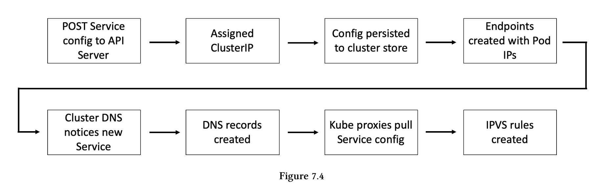
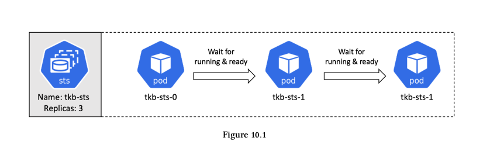
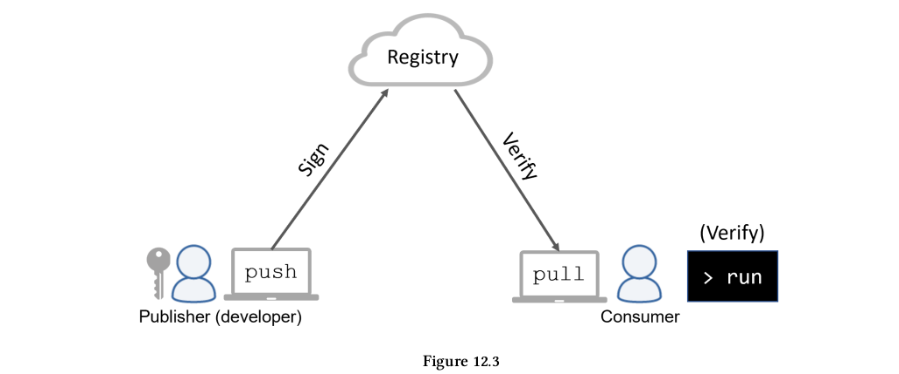

# The Kubernetes Book

## Table of Contents

- [The Kubernetes Book](#the-kubernetes-book)
  - [Table of Contents](#table-of-contents)
  - [About](#about)
  - [1: Kubernetes primer](#1-kubernetes-primer)
  - [2: Kubernetes principles of operation](#2-kubernetes-principles-of-operation)
    - [Chapter summary](#chapter-summary)
  - [3: Installing Kubernetes](#3-installing-kubernetes)
    - [Chapter summary](#chapter-summary-1)
  - [4: Working with Pods](#4-working-with-pods)
    - [Pod theory summary](#pod-theory-summary)
    - [Sample manifest file:](#sample-manifest-file)
    - [Command](#command)
  - [5: Kubernetes Deployments](#5-kubernetes-deployments)
    - [Chapter summary](#chapter-summary-2)
    - [Sample manifest file:](#sample-manifest-file-1)
    - [Command](#command-1)
  - [6: Kubernetes Services](#6-kubernetes-services)
    - [Chapter summary](#chapter-summary-3)
    - [Sample manifest file](#sample-manifest-file-2)
    - [Command](#command-2)
  - [7: Service discovery](#7-service-discovery)
    - [Chapter summary](#chapter-summary-4)
    - [Command](#command-3)
  - [8: Kubernetes storage](#8-kubernetes-storage)
    - [Chapter summary](#chapter-summary-5)
    - [Sample manifest file](#sample-manifest-file-3)
    - [Command](#command-4)
  - [9: ConfigMaps](#9-configmaps)
    - [Chapter summary](#chapter-summary-6)
    - [Sample manifest file](#sample-manifest-file-4)
    - [Command](#command-5)
  - [10: StatefulSets](#10-statefulsets)
    - [Chapter summary](#chapter-summary-7)
    - [Sample manifest file](#sample-manifest-file-5)
    - [Command](#command-6)
  - [11: Threat modeling Kubernetes](#11-threat-modeling-kubernetes)
    - [Chapter summary](#chapter-summary-8)
  - [12: Real-world Kubernetes security](#12-real-world-kubernetes-security)
    - [Chapter summary](#chapter-summary-9)
- [Glossary](#glossary)
  - [References](#references)

## About

Write about 1-2 paragraphs describing the purpose of your project.

## 1: Kubernetes primer
- Kubernetes was created by Google based on lessons learned running containers at scale for many years. 
- It was donated to the community as an open-source project and is now the industry standard API for deploying and managing cloud-native applications. 
- It runs on any cloud or on-premises data center and abstracts the underlying infrastructure. 
- This allows you to build hybrid clouds, as well as migrate easily between cloud platforms. 
- It’s open-sourced under the Apache 2.0 license and lives within the Cloud Native Computing Foundation (CNCF).

## 2: Kubernetes principles of operation
### Chapter summary
- We introduced some of the major components of a Kubernetes cluster.
- Masters make all of the deployment and scheduling decisions, and multi-master HA is important for production-grade environments.
- The masters are where the control plane components run. Under-the-hood, there are several system-services, including:

  - The API Server: 
    - The front-end into the control plane and all instructions and communication must go through it. 
    - By default, it exposes a RESTful endpoint on port 6443.
  - The cluster store: 
    - Stores the entire configuration and state of the cluster.
  - The scheduler: 
    - Watches the API server for new work tasks 
    - Assigns them to appropriate healthy nodes.
  - The controller manager (controller of controllers): 
    - Spawns all of the independent control loops and monitors them.
    - Some controller: the node controller, the endpoints controller, and the replicaset controller.

- Nodes are where user applications run. 

- Each node runs a service called the kubelet: 
  - That registers the node with the cluster and communicates with the API Server. 
  - It watches the API for new work tasks and maintains a reporting channel. 
- Nodes also have a container runtime and the kube-proxy service. 
  - The container runtime, such as Docker or containerd, is responsible for all container-related operations. 
  - The kube-proxy is responsible for networking on the node.

- We also talked about some of the major Kubernetes API objects such as Pods, Deployments, and Services. 

  - The Pod is the basic building-block. 
  - Deployments add self-healing, scaling and updates.
  - Services add stable networking and load-balancing.

- **NOTE**: Throughout the book we’ll use terms like control loop, watch loop, and reconciliation loop:
  - Control loop runs as a background watch-loop that is constantly watching the API Server for changes.
  - Reconciliation loop: drive the observed state toward the desired state.

## 3: Installing Kubernetes
### Chapter summary
- You saw a few ways to get a Kubernetes cluster.
  - You saw how fast and simple it is to setup a Kubernetes cluster on Play with Kubernetes (PWK)
- You saw how to setup Docker Desktop for a great single-node developer experience on our laptops.
- You learned how to spin up a managed/hosted Kubernetes cluster in the Google Cloud using Google Kubernetes Engine (GKE).
- The chapter finished up with an overview of kubectl, then Kubernetes command-line tool.
- Setup node: [Setup ha cluster kubeadmin](SETUP_HA_CLUSTER_KUBEADM.md)

## 4: Working with Pods
### Pod theory summary
- Pods are the atomic unit of scheduling in Kubernetes

- You can have more than one container in a Pod. 


- Pods get scheduled on nodes – you can’t schedule a single Pod instance to span multiple nodes
- Pods are defined declaratively in a manifest file that is POSTed to the API Server and assigned to nodes by the scheduler
- You almost always deploy Pods via higher-level controllers

### Sample manifest file:
```
apiVersion: v1
kind: Pod
metadata:
  name: hello-pod
  labels:
    zones: prod
    version: v1
spec:
  containers:
    - name: hello-ctr
      image: nigelpoulton/k8sbook:latest
      ports:
        - containerPort: 8080
```
- We can see four top-level resources: apiVersion, kind, metadata, spec.
  - `.apiVersion`: format for apiVersion `<api-group>/<version`.
  - `.kind`: tells Kubernetes the type of object is being deployed.
  - `.metadata`: section is where you attach a name and labels.
  - `.spec`: section is where you define the containers that will run in the Pod.
### Command
```
kubectl apply -f TheK8sBook/chapter4/pod.yaml 
kubectl get pods
kubectl get pods --watch
kubectl get pods -o wide
kubectl get pods hello-pod -o yaml
kubectl describe pods hello-pod 
kubectl exec hello-pod -- ps aux
kubectl exec -it hello-pod -- sh
kubectl logs hello-pod 
kubectl delete -f TheK8sBook/chapter4/pod.yaml
```

## 5: Kubernetes Deployments
### Chapter summary
- Deployments are a great way to manage Kubernetes apps. 
  - They build on top of Pods by adding self-healing, scalability, rolling updates, and rollbacks. 
  - Behind-the-scenes, they leverage ReplicaSets for the self-healing and scalability parts.
- Single Deployment object can only manage a single Pod template.
- Like Pods, Deployments are objects in the Kubernetes API, and you should work with them declaratively.

- When you perform updates with the kubectl apply command, older versions of ReplicaSets get wound down, but they stick around making it easy to perform rollbacks.

### Sample manifest file:
```
apiVersion: apps/v1
kind: Deployment
metadata:
  name: hello-deploy
spec:
  replicas: 10
  selector:
    matchLabels:
      app: hello-world
  minReadySeconds: 10
  strategy:
    type: RollingUpdate
    rollingUpdate:
      maxUnavailable: 1
      maxSurge: 1
  template:
    metadata:
      labels:
        app: hello-world
    spec:
      containers:
        - name: hello-pod
          image: nigelpoulton/k8sbook:latest
          ports:
            - containerPort: 8080
```
- Deployment objects are in the apps/v1 API group
- `.kind`:  defining a Deployment object.
- `.spec.template`: relates to the Pod template that the Deployment will manage.
- `.spec.replicas`: number Pod replicas to deploy.
- `.spec.selector`: list of labels that Pods must have.
- `.spec.minReadySeconds`: wait for 10 seconds between each Pod being updated.
- `.spec.strategy`: perform updates to the Pods managed by the Deployment.
  - Update using the `RollingUpdate` strategy
  - Never have more than one Pod below desired state (`maxUnavailable: 1`)
  - Never have more than one Pod above desired state (`maxSurge: 1`)

### Command
```
kubectl apply -f TheK8sBook/chapter5/deploy.yaml
kubectl get deploy hello-deploy
kubectl describe deploy hello-deploy
kubectl get rs
kubectl apply -f TheK8sBook/chapter5/svc.yaml
# Update deploy.yaml and apply again
kubectl apply -f TheK8sBook/chapter5/deploy.yaml
kubectl rollout status deployment hello-deploy
kubectl get deploy hello-deploy
kubectl rollout history deployment hello-deploy
kubectl get rs
kubectl rollout undo deployment hello-deploy --to-revision=1
# should update deploy.yaml file.
kubectl get deploy hello-deploy
kubectl rollout status deployment hello-deploy
```

## 6: Kubernetes Services
### Chapter summary
- Services bring stable and reliable networking to apps deployed on Kubernetes.
- They perform load-balancing and allow you to expose elements of your application to the outside world (outside of the Kubernetes cluster).

  - The front-end of a Service is fixed, providing stable networking for the Pods behind it. 
  - The back-end of a Service is dynamic, allowing Pods to come and go without impacting the ability of the Service to provide load-balancing.
- Services are first-class objects in the Kubernetes API and can be defined in the standard YAML manifest files.

- They use label selectors to dynamically match Pods, and the best way to work with them is declaratively.
- Every Service gets its own Endpoints object with the same name as the Service

**NOTE:**
- The four common ServiceTypes are:
  - `ClusterIP`: gives the Service a stable IP address internally within the cluster.
  - `NodePort`: builds on top of `ClusterIP` and adds a cluster-wide TCP or UDP port.
  - `LoadBalancer`: builds on top of `NodePort` and integrates with cloud-based load-balancers.
  - `ExternalName`: direct traffic to services that exist outside of the Kubernetes cluster.

### Sample manifest file
```
apiVersion: v1
kind: Service
metadata:
  name: hello-svc
spec:
  type: NodePort
  ports:
    - port: 8080
      nodePort: 30001
      targetPort: 8080
      protocol: TCP
  selector:
    app: hello-world
```
- Services are mature objects defined in the v1 core API group
- `.kind`: defining a Service object.
- `.metadata`: defines a name for the Service (not related to labels for selecting Pods).
- `.spec.type`: deploy a `NodePort` Service. 
- `port`: the listening Service port for internal requests.
- `nodePort`: port for external requestss.
- `targetPort`: the listening application Pods port.

### Command
```
kubectl apply -f TheK8sBook/chapter6/deploy.yaml
kubectl expose deployment web-deploy --name=hello-svc --target-port=8080 --type=NodePort
kubectl describe svc hello-svc
kubectl delete svc hello-svc

kubectl apply -f TheK8sBook/chapter6/svc.yaml
kubectl get svc hello-svc
kubectl describe svc hello-svc
kubectl get ep hello-svc
Kubectl describe ep hello-svc
```

## 7: Service discovery
### Chapter summary
- **Service registration**
- A few important things to note about this in Kubernetes:

  - Kubernetes uses an internal DNS service as its service registry
  - Services register with DNS
  - The name, IP address, and network port of every Service is registered

- Kubernetes automatically creates an Endpoints object (or Endpoint slices) for every Service

- Simple flow diagram summarise the service registration process.

- **Service discovery**

- Kubenetes converting names to IP addresses using the cluster DNS.

- Simple flow diagram summarise the service discovery process.

- **Service discovery and Namespaces**

- Every cluster has an address space
- Namespaces partition the cluster address space

### Command
```
kubectl apply -f TheK8sBook/chapter7/sd-example.yaml
kubectl get all -n dev
kubectl get all -n prod
kubectl exec -it jump -n dev -- bash
# in container terminal
cat /etc/resolv.conf
apt-get update && apt-get install curl -y
curl ent:8080
curl ent.prod.svc.cluster.local:8080
exit
# exit container
kubectl get deploy -n kube-system -l k8s-app=kube-dns
kubectl get pods -n kube-system -l k8s-app=kube-dns
kubectl logs coredns-6d4b75cb6d-g2z6s -n kube-system 
kubectl get svc -n kube-system -l k8s-app=kube-dns
kubectl get ep -n kube-system -l k8s-app=kube-dns
kubectl run -it dnsutils --image gcr.io/kubernetes-e2e-test-images/dnsutils:1.3
exit
kubectl delete pods dnsutils
```

## 8: Kubernetes storage
### Chapter summary
- Kubernetes has a powerful storage subsystem that allows it to leverage storage from a wide variety of external storage back-ends.

- The plugin layer is based on the Container Storage Interface (CSI).
- Once a plugin is enabled, Persistent Volumes (PV) are used to represent external storage resources on the Kubernetes cluster.
- Persistent Volume Claims (PVC) are used to give Pods access to PV storage.
- Storage Classes take things to the next level by allowing applications to dynamically request storage.
  - Storage Class object that references a class, or tier, of storage from a storage back-end.
  - Storage Class watches the API Server for new Persistent Volume Claims that reference the Storage Class.
  - When a matching PVC arrives, the SC dynamically creates the storage and makes it available as a PV storage.
  - StorageClass objects are immutable - this means you cannot modify them once deployed.

### Sample manifest file
```
apiVersion: storage.k8s.io/v1
kind: StorageClass
metadata:
  name: rook-cephfs
provisioner: rook-ceph.cephfs.csi.ceph.com # driver:namespace:operator
parameters:
  clusterID: rook-ceph # namespace:cluster
  fsName: k8sfs
  ...
reclaimPolicy: Delete
allowVolumeExpansion: true
```
- `.provisioner`: tells Kubernetes which plugin to use.
- `.parameters`: is for plugin-specific values.
- `.reclaimPolicy`: to do when PVC has been released (Delete or Retain).

```
apiVersion: v1
kind: PersistentVolumeClaim
metadata:
  name: pv-ticket
spec:
  accessModes:
    - ReadWriteOnce
  storageClassName: rook-cephfs
  resources:
    requests:
      storage: 10Gi
```
- `.spec.accessModes` defines how the PV can be mounted. Three options exist:
  - ReadWriteOnce (RWO)
  - ReadWriteMany (RWM)
  - ReadOnlyMany (ROM)

```
apiVersion: v1
kind: Pod
metadata:
  name: class-pod
spec:
  volumes:
    - name: data
      persistentVolumeClaim:
        claimName: pv-ticket
  containers:
    - name: ubuntu-ctr
      image: ubuntu:latest
      command:
        - /bin/bash
        - "-c"
        - "sleep 60m"
      volumeMounts:
        - mountPath: /data
          name: data
```
- `.spec.volumes`: defines a volume called data using the pv-ticket PVC.
- `volumeMounts`: defines a container that mounts the data volume to /data.

### Command
```
kubectl apply -f TheK8sBook/chapter8/rook-ceph-sc.yaml
kubectl apply -f TheK8sBook/chapter8/rook-ceph-pvc.yaml
kubectl apply -f TheK8sBook/chapter8/rook-ceph-pod.yaml
kubectl exec -it class-pod --bash
exit
kubectl get sc
kubectl get pvc
kubectl get pods -o wide
```

## 9: ConfigMaps
### Chapter summary
- ConfigMaps are the mechanism that Kubernetes provides for decoupling applications and their configuration.
- ConfigMaps are first-class object in the Kubernetes API
- Ideal for storing application configuration parameters as well as entire configuration files.
- They shouldn’t be used to store sensitive data.
- ConfigMap data gets injected into containers at run-time.

- You can inject data via environment variables, container startup commands, and volumes.
- The volumes method is the most flexible as it allows you work with entire configuration files. 

### Sample manifest file
```
apiVersion: v1
kind: ConfigMap
metadata:
  name: multimap
data:
  given: Nigel
  family: Poulton
```
- `data` section that defines the map of key/values.

### Command
```
kubectl create configmap testmap1 --from-literal shortname=msb.com --from-literal longname=magicsanbox.com
kubectl describe cm testmap1
kubectl create cm testmap2 --from-file TheK8sBook/chapter9/cmfile.txt
kubectl describe cm testmap2
kubectl create cm testmap2 --from-file TheK8sBook/chapter9/multimap.yaml
kubectl get cm multimap -o yaml
kubectl create cm testmap2 --from-file TheK8sBook/chapter9/envpod.yaml
kubectl get pods cmvol
kubectl exec cmvol -- ls /etc/name
```

## 10: StatefulSets
### Chapter summary
- StatefulSets create and manage applications that need to persist state.
- They can self-heal, scale up and down, and perform updates. 
- Rollbacks require manual attention.
- StatefulSets guarantee:
  - Predictable and persistent Pod names.
  - Predictable and persistent DNS hostnames.
  - Predictable and persistent volume bindings.
- The format of StatefulSet Pod names is `<StatefulSetName>-<Integer>`

- Volumes it needs are created at the same time StatefulSet Pod is created.

- StatefulSets that use StorageClass (SC) to be able to create volume dynamically.
- Contructs DNS subdomains: `<object-name>.<service-name>.<namespace>.svc.cluster.local`
- Headless Services create predictable stable DNS entries for every Pod that matches the StatefulSets label selector.
- StatefulSets are only a framework. Applications need to be written in ways to take advantage of the way StatefulSets behave.

### Sample manifest file
```
apiVersion: v1
kind: Service
metadata:
  name: dullahan
  labels:
    app: web
spec:
  ports:
    - port: 80
      name: web
  clusterIP: None
  selector:
    app: web
```
- Headless Service must set the value `clusterIP` to `None`.

```
apiVersion: apps/v1
kind: StatefulSet
metadata:
  name: tkb-sts
spec:
  replicas: 3
  selector:
    matchLabels:
      app: web
  serviceName: "dullahan"
  template:
    metadata:
      labels:
        app: web
    spec:
      terminationGracePeriodSeconds: 10
      containers:
        - name: ctr-web
          image: nginx:latest
          ports:
            - containerPort: 80
              name: web
          volumeMounts:
            - mountPath: /usr/share/nginx/html
              name: webroot
  volumeClaimTemplates:
    - metadata:
        name: webroot
      spec:
        accessModes: [ "ReadWriteOnce" ]
        storageClassName: "rook-cephfs"
        resources:
          requests:
            storage: 1Gi
```
- The name of the StatefulSet is `tkb-sts`. Every Pod created have a name starting with `tkb-sts`.
- `.spec.replicas`: 3 Pod replicas (named `tsk-sts-0`, `tsk-sts-1`, and `tsk-sts-2.`)
- `.spec.serviceName`: designates the governing Service.
- `.spec.template` section: defines the Pod template.
- `.spec.volumeClaimTemplates` section: dynamically creates a PVC each time a new Pod replica is dynamically created.

### Command
```
kubectl apply -f TheK8sBook/chapter10/rook-ceph-sc.yaml
kubectl apply -f TheK8sBook/chapter10/headless-svc.yaml
kubectl get svc
kubectl describe svc dullahan
kubectl apply -f TheK8sBook/chapter10/sts.yaml
kubectl get sts --watch
kubectl get pvc
kubectl get pods
kubectl get svc
kubectl apply -f TheK8sBook/chapter10/jump-pod.yaml 
kubectl exec -it jump-pod -- bash
dig SRV dullahan.rook-ceph.svc.cluster.local
exit
# check scale down: edit replicas to 2
kubectl apply -f TheK8sBook/chapter10/sts.yaml
kubectl get pvc
kubectl get pods
# check scale up: edit replicas to 3
kubectl apply -f TheK8sBook/chapter10/sts.yaml
kubectl get pvc
kubectl get pods
```
## 11: Threat modeling Kubernetes
### Chapter summary
- We used STRIDE to threat model Kubernetes:
  - Spoofing: is pretending to be something, or somebody, you are not.
    - Securing communications with the API server.
    - Securing Pod communications.
  - Tampering: the act of changing something in a malicious way.
    - Tampering with Kubernetes components.
    - Tampering with applications running on Kubernetes.
  - Repudiation: is casting doubt on something. Non-repudiation is providing proof about something.
  - Information Disclosure: is when sensitive data is leaked.
    - Protecting cluster data (etcd).
    - Protecting data in Pods.
  - Denial of Service: is all about making something unavailable.
    - Protecting cluster resources against DoS attacks (HA, limit resources).
    - Protecting the API Server against DoS attacks (HA, Firewall rule).
    - Protecting the cluster store against DoS attacks (HA).
    - Protecting application components against DoS attacks.

  - Elevation of privilege: is gaining higher access than what is granted, usually in order to cause damage or gain unauthorized access.
    - Protecting the API server (BRAC).
    - Protecting Pods:
      - Do not run processes as root.
      - Drop capabilities.
      - Filter syscalls.
      - Prevent privilege escalation by containers.
- We saw that one threat can often lead to another, and that there are multiple ways to mitigate a single threat. As always, defence in depth is a key tactic.
- We finished the chapter by discussing how Pod Security Policies provide a flexible and scalable way to implement Pod security defaults.

## 12: Real-world Kubernetes security
### Chapter summary
- We started out by looking at ways to secure the software delivery pipeline by discussing some image-related best practices:
  - Use approved base images

  - Control access to images
  - Moving images from non-production to production
  - Vulnerability scanning
  - Configuration as code
  - Cryptographically signing images.

- we looked at some of the workload isolation options that exist at different layers of the infrastructure stack:
  - Cluster-level workload isolation
    - Namespaces and soft multi-tenancy
    - Namespaces and hard multi-tenancy
  - Node isolation
  - Runtime isolation
    - Traditional namespaced containers
    - Use appropriate runtime classes
  - Network isolation
    - Kubernetes and overlay networking

    - Kubernetes and BGP

    - How this impacts firewalls
    - Packet capture
- We talked about Identity and access management (IAM):
  - Managing Remote SSH access to cluster nodes
  - Multi-factor authentication (MFA)
- We talked Auditing and security monitoring
  - Secure Configuration (kube-bench)
  - Container and Pod lifecycle Events
  - Application logs
  - Actions performed by users
  - Managing log data

# Glossary
- **API Server**: Exposes the features of Kubernetes over an HTTPS REST interface. All communication with Kubernetes goes through the API Server – even cluster components communicate via the API Server.
- **Container**: Lightweight environment for running modern apps. Each container is a virtual operating system with its own process tree, filesystem, shared memory, and more. One container runs one application process.
- **Cloud native**: This is a loaded term and means different things to different people. I personally consider an application to be cloud-native if it can self-heal, scale on-demand, perform rolling updates, and possibly rollbacks. They’re usually microservices apps.
- **ConfigMap**: Kubernetes object used to hold non-sensitive configuration data. A great way to add custom configuration data to a generic application template without editing the template.
- **Container Network Interface (CNI)**: Pluggable interface enabling different network topologies and architectures. 3rd-parties provide various CNI plugins that enable overlay networks, BGP networks, and various implementations of each.
- **Container runtime:** Low-level software running on every cluster Node responsible for pulling container images, starting containers, stopping containers, and other low-level container operations. Typically Docker or containerd.
- **Container Runtime Interface (CRI)**: Interface that allows container runtimes to be pluggable. With the CRI you can choose the best container runtime for your requirements (Docker, containerd, cri-o, kata, etc.).
- **Container Storage Interface (CSI)**: Interface enabling external 3rd-party storage systems to integrate with Kubernetes. Storage vendors write a CSI driver/plugin that runs as a set of Pods on a cluster and exposes the storage system’s enhanced features to the cluster and applications.
- **Controller**: Control plane process running as a reconciliation loop monitoring the cluster (via the API Server) and making the necessary changes so the observed state of the cluster matches desired state.
- **Cluster store**: Holds cluster state, including desired state and observed state. Typically based on the etcd deistributed data store and runs on the Masters. Can be deployed separately to its own cluster for higher performance and higher availability.Glossary
- **Deployment**: Controller that deploys and manages a set of stateless Pods. Performs rolling updates and versioned rollbacks. Uses a ReplicaSet controller to perform scaling and self-healing operations.
- **Desired state**: What the cluster and apps should be like. For example, the desired state of an application microservice might be 5 replicas of xyz container listening on port 8080/tcp. 
- **Endpoints object**: Up-to-date list of healthy Pods that match a Service’s label selector. Basically, it’s the list of Pods that a Service will send traffic to. Might eventually be replaced by EndpointSlices. 
- **K8s**: Because writing Kubernetes is too hard ;-) The 8 replaces the eight characters in Kubernetes between the “K” and the “s”. Pronounced “Kates”. The reason why people say Kubernetes’ girlfriend is called Kate ¯\_(�)_/¯.
- **kubectl**: Kubernetes command line tool. Sends commands to the API Server and queries state via the API Server.
- **Kubelet**: The main Kubernetes agent running on every cluster Node. It watches the API Server for new work assignments and maintains a reporting channel back.
- **Kube proxy**: Runs on every cluster node and implements low-level rules that handle routing of traffic from Services to Pods. You send traffic to stable Service names and kube-proxy makes sure the traffic reaches Pods.
- **Label**: Metadata applied to objects for grouping. For example, Services send traffic to Pods based on matching labels.
- **Label selector**: Used to identify Pods to perform actions on. For example, when a Deployment performs a rolling update, it knows which Pods to update based on its label selector – only Pods with the labels matching the Deployment’s label selector will be replaced and updated.
- **Manifest file**: YAML file that holds the configuration of one or more Kubernetes objects. For example, a Service manifest file is typically a YAML file that holds the configuration of the Service. When you post a manifest file to the API Server, its configuration is deployed to the cluster.
- **Master**: The brains of a Kubernetes cluster. A node that hosts control plane features (API Server, cluster store, scheduler etc.). Usually deployed in highly available configurations of 3, 5, or 7.
- **Microservices**: A design pattern for modern applications. Application features are broken out into their own small applications (microservices) and communicate via APIs. They work together to form a useful application experience.
- **Namespace**: A way to partition a single Kubernetes cluster into multiple virtual clusters. Good for applying different quotas and access control policies on a single cluster. Not suitable for strong workload isolation.
- **Node**: The workers of a Kubernetes cluster. A cluster node designed to run user applications. Runs the kubelet process, a container runtime, and kube-proxy service.
- **Observed state**: Also known as current state or actual state. This is the latest view of the cluster and running applications. Controllers are always working to make observed state match desired state.
- **Orchestrator**: A piece of software that deploys and manages apps. Modern apps are made from lots of smaller apps that work together to form a useful application. Kubernetes orchestrates/manages these small apps and keeps them healthy, scales them up and down, and more…
- **PersistentVolume (PV)**: Kubernetes object used to map storage volumes on a cluster. Storage resources must be mapped to PVs before they can be used by applications.
- **PersistentVolumeClaim (PVC)**: Like a ticket/voucher that allows an app to use a PV. Without a valid PVC, an app cannot use a PV. Combined with StorageClasses for dynamic volume creation.
- **Pod**: Smallest unit of scheduling on Kubernetes. Every container running on Kubernetes must run inside a Pod. The Pod provides a shared execution environment – IP address, volumes, shared memory etc.
- **Reconciliation loop**: A controller process watching the state of the cluster, via the API Server, ensuring observed state matches desired state.
- **ReplicaSet**: Runs as a controller and performs self-healing and scaling. Used by Deployments.
- **Secret**: Like a ConfigMap for sensitive configuration data.
- **Service**: Capital “S”. Provides stable networking for a dynamic set of Pods. By placing a Service in front of a set of Pods, the Pods can fail, scale up and down, and be replaced without the network endpoint for accessing them changing.
- **StatefulSet**: Controller that deploys and manages stateful Pods. Similar to a Deployment, but for stateful applications.
- **StorageClass (SC)**: Way to create different storage tiers/classes on a cluster. You may have an SC called “fast” that creates NVMe-based storage, and another SC called “medium-three-site” that creates slower storage replicated across three sites.
- **Volume**: Generic term for persistent storage.

## References
https://man7.org/linux/man-pages/man7/capabilities.7.html
